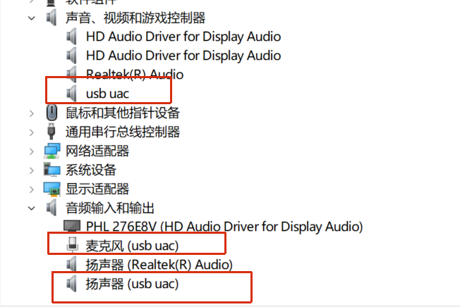

# 使用注意事项：

1. 如果要修改**配置参数**时，将`sdkconfig`删除，将修改内容写入到`sdkconfig.defaults`中，进行清除和重新编译。

2. 修改配置后，respeaker插入电脑需要删除设备

   

3. 使用48k,32bit时，需要修改...\managed_components\espressif__tinyusb\src\portable\synopsys\dwc2\dcd_dwc2.c中的内容：

```c
TU_ATTR_ALWAYS_INLINE static inline uint16_t calc_device_grxfsiz(uint16_t largest_ep_size, uint8_t ep_count) {
  return 13 + 1 + ((largest_ep_size / 4) + 1) + 2 * ep_count; //修改
}
```


```c
static void dfifo_device_init(uint8_t rhport) {
  const dwc2_controller_t* dwc2_controller = &_dwc2_controller[rhport];
  dwc2_regs_t* dwc2 = DWC2_REG(rhport);
  dwc2->grxfsiz = calc_device_grxfsiz(CFG_TUD_ENDPOINT0_SIZE, dwc2_controller->ep_count);

  // Scatter/Gather DMA mode is not yet supported. Buffer DMA only need 1 words per endpoint direction
  const bool is_dma = dma_device_enabled(dwc2);
  _dcd_data.dfifo_top = dwc2_controller->ep_fifo_size/4;
  if (is_dma) {
    _dcd_data.dfifo_top -= 2 * dwc2_controller->ep_count;
  }
  dwc2->gdfifocfg = (_dcd_data.dfifo_top << GDFIFOCFG_EPINFOBASE_SHIFT) | _dcd_data.dfifo_top;
  dwc2->gahbcfg |= GAHBCFG_TX_FIFO_EPMTY_LVL; //添加

  // Allocate FIFO for EP0 IN
  dfifo_alloc(rhport, 0x80, CFG_TUD_ENDPOINT0_SIZE);
}

```


